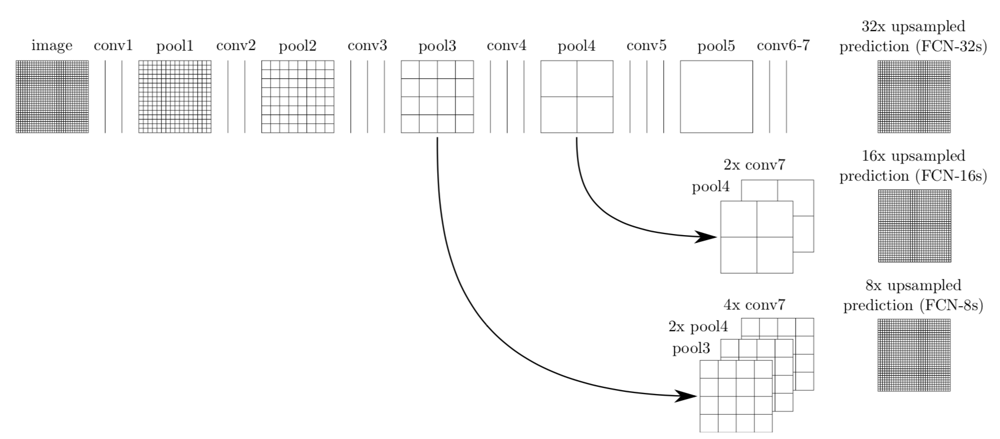

# Semantic Segmentation

## Aim of the project

The aim of the semantic segmentation project is to label the pixels of
a road in images with the use of neural networks. In contrast to the
"Vehicle Detection" or "Traffic Sign Classifier" projects in Term 1,
pixel-by-pixel spatial information should be kept and written to the
images after inference.

## Applied techniques

This project builds a Fully-Convolutional network (FCN). FCNs consist
of several (convolutional) encoder layers that extract certain
information, just as in a convolutional neural network (CNN). In
comparism to CNNs, these convolutions are not followed by
fully-connected layers but 1x1 convolutions, that allow "matrix
multiplication with spatial information". The next layers are
transposed convolutions, that result in an output layer of the same
size as the initial input layer. The FCN is completed by adding "skip
connections", that allow to preserve certain spatial information by
skipping part of the encoding and decoding layers.

In this project, the encoding part of the FCN will not be trained.
Instead, a pre-trained and "frozen" network (VGG16) will be used.
In order to keep the training effort on a manageable level, just the
decoding layers will be trained ("Transfer Learning").

## Approach

As with the other projects of the Self-Driving Car Nano-Degree, most of the 
code was [provided by Udacity](https://github.com/udacity/CarND-Semantic-Segmentation). 
All open To Dos are found within the main.py script, which is divided 
into several functions:
* ***load_vgg*** is used to load the frozen "VGG16" neural network and 
extract the handles/pointers to the layers that will be used to build the FCN.
* ***layers*** builds the fully-convolutional neural network. As it will be 
used multiple times, I decided to define the 1x1 convolution function 
inside the layer function. The layout of the FCN was carried over from 
[J. Long, E. Shelhamer, T.Darrell. Fully Convolutional Networks for Semantic Segmentation.](https://people.eecs.berkeley.edu/~jonlong/long_shelhamer_fcn.pdf)



## Original README information by Udacity

### Introduction
In this project, you'll label the pixels of a road in images using a Fully Convolutional Network (FCN).

### Setup
##### Frameworks and Packages
Make sure you have the following is installed:
 - [Python 3](https://www.python.org/)
 - [TensorFlow](https://www.tensorflow.org/)
 - [NumPy](http://www.numpy.org/)
 - [SciPy](https://www.scipy.org/)
##### Dataset
Download the [Kitti Road dataset](http://www.cvlibs.net/datasets/kitti/eval_road.php) from [here](http://www.cvlibs.net/download.php?file=data_road.zip).  Extract the dataset in the `data` folder.  This will create the folder `data_road` with all the training a test images.

### Start
##### Implement
Implement the code in the `main.py` module indicated by the "TODO" comments.
The comments indicated with "OPTIONAL" tag are not required to complete.
##### Run
Run the following command to run the project:
```
python main.py
```
**Note** If running this in Jupyter Notebook system messages, such as those regarding test status, may appear in the terminal rather than the notebook.

### Submission
1. Ensure you've passed all the unit tests.
2. Ensure you pass all points on [the rubric](https://review.udacity.com/#!/rubrics/989/view).
3. Submit the following in a zip file.
 - `helper.py`
 - `main.py`
 - `project_tests.py`
 - Newest inference images from `runs` folder  (**all images from the most recent run**)
 
 ### Tips
- The link for the frozen `VGG16` model is hardcoded into `helper.py`.  The model can be found [here](https://s3-us-west-1.amazonaws.com/udacity-selfdrivingcar/vgg.zip)
- The model is not vanilla `VGG16`, but a fully convolutional version, which already contains the 1x1 convolutions to replace the fully connected layers. Please see this [forum post](https://discussions.udacity.com/t/here-is-some-advice-and-clarifications-about-the-semantic-segmentation-project/403100/8?u=subodh.malgonde) for more information.  A summary of additional points, follow. 
- The original FCN-8s was trained in stages. The authors later uploaded a version that was trained all at once to their GitHub repo.  The version in the GitHub repo has one important difference: The outputs of pooling layers 3 and 4 are scaled before they are fed into the 1x1 convolutions.  As a result, some students have found that the model learns much better with the scaling layers included. The model may not converge substantially faster, but may reach a higher IoU and accuracy. 
- When adding l2-regularization, setting a regularizer in the arguments of the `tf.layers` is not enough. Regularization loss terms must be manually added to your loss function. otherwise regularization is not implemented.
 
### Using GitHub and Creating Effective READMEs
If you are unfamiliar with GitHub , Udacity has a brief [GitHub tutorial](http://blog.udacity.com/2015/06/a-beginners-git-github-tutorial.html) to get you started. Udacity also provides a more detailed free [course on git and GitHub](https://www.udacity.com/course/how-to-use-git-and-github--ud775).

To learn about REAMDE files and Markdown, Udacity provides a free [course on READMEs](https://www.udacity.com/courses/ud777), as well. 

GitHub also provides a [tutorial](https://guides.github.com/features/mastering-markdown/) about creating Markdown files.
